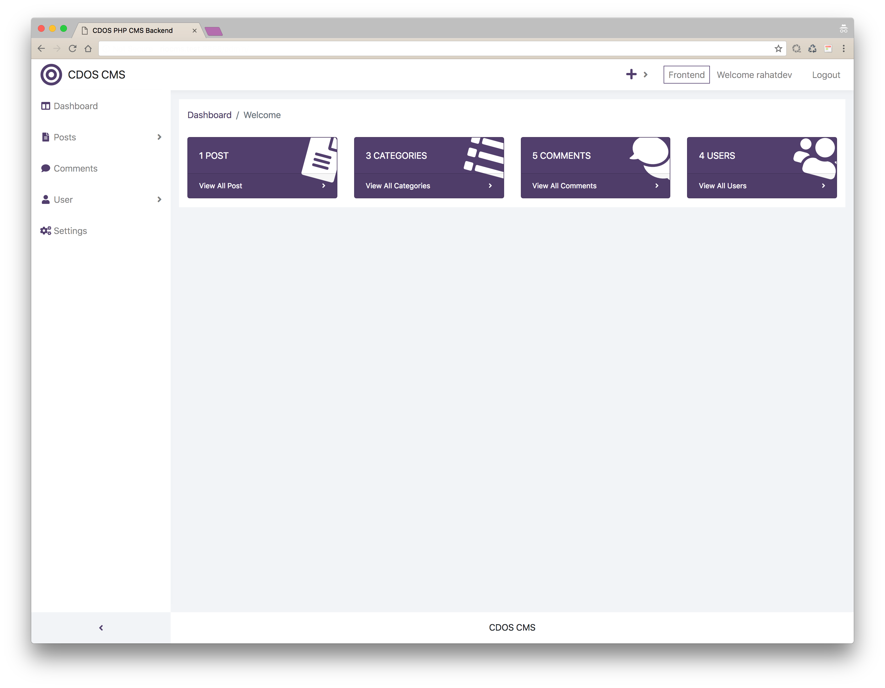
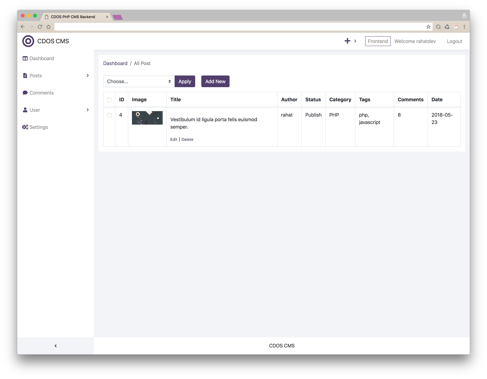

# CDOS PHP CMS

*_(This is an experimental PHP project)_*

Demo Frontend: Coming Soon

Demo Backend: Coming Soon

The CMS contains all of the major features need for a content management system. Some of the highlight features are:

## Highlight Features

V 0.1

* Secure User Registration system
* Secure User Login system
* Dashboard with focus widget
* Dynamic Post system
* Dynamic Post category, tag
* Dynamic Comment system
* Dynamic User system
* Bulk option

Check this [Change Log](change-log.txt) file for full details.